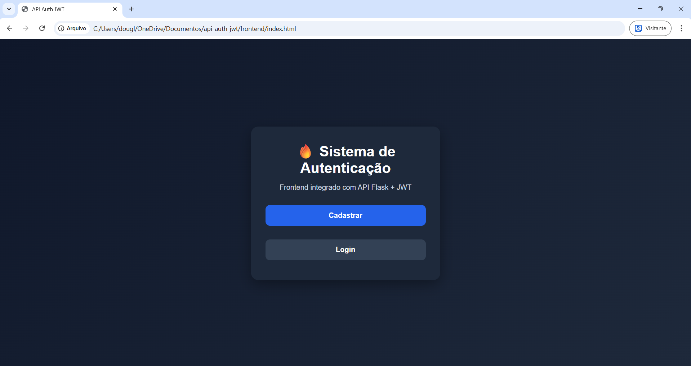
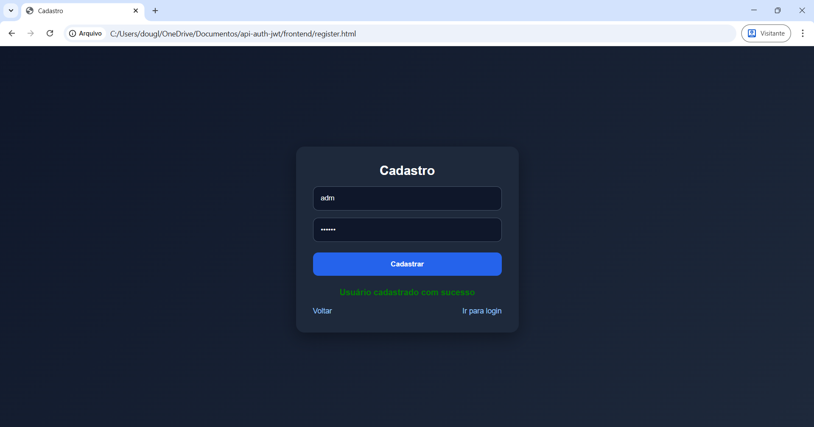
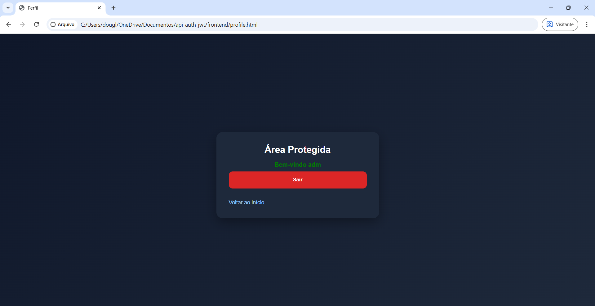
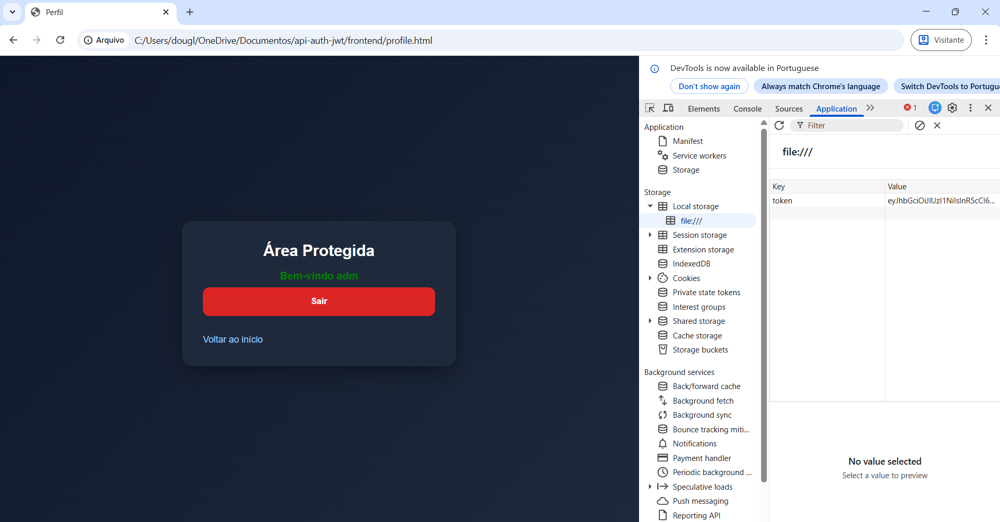

# 🔥 API Auth JWT - Sistema de Autenticação

Projeto fullstack de autenticação utilizando **Flask** (backend) e **HTML, CSS e JavaScript** (frontend), com implementação de **JWT (JSON Web Token)** para controle de acesso.

---

## 🚀 Funcionalidades

- Cadastro de usuário
- Login com validação
- Geração de token JWT
- Armazenamento do token no navegador (`localStorage`)
- Acesso a rota protegida
- Logout

---

## 🧠 Tecnologias utilizadas

### Backend
- Python
- Flask
- Flask-CORS
- PyJWT

### Frontend
- HTML5
- CSS3
- JavaScript (Vanilla)

---

## 📁 Estrutura do projeto

```bash
api-auth-jwt/
│
├── assets/
│   └── screenshots/
│       ├── auth-home.png
│       ├── auth-register.png
│       ├── auth-profile.png
│       └── auth-token.png
│
├── backend/
│   ├── models/
│   ├── routes/
│   ├── services/
│   ├── app.py
│   ├── requirements.txt
│   └── .gitignore
│
├── frontend/
│   ├── css/
│   │   └── style.css
│   ├── js/
│   │   ├── login.js
│   │   ├── register.js
│   │   └── profile.js
│   ├── index.html
│   ├── login.html
│   ├── register.html
│   └── profile.html
│
└── README.md
```

---

## 📸 Demonstração

### 🏠 Tela inicial


### 📝 Cadastro de usuário


### 🔐 Área protegida (após login)


### 🧠 Token JWT armazenado no navegador


---

## ⚙️ Como executar o projeto

### 1. Clonar o repositório

```bash
git clone https://github.com/douglasalvesti/api-auth-jwt.git
cd api-auth-jwt
```

### 2. Criar ambiente virtual (opcional)

```bash
python -m venv venv
venv\Scripts\activate
```

### 3. Instalar dependências

```bash
pip install -r backend/requirements.txt
```

### 4. Rodar o backend

```bash
py backend/app.py
```

Servidor rodando em:

```txt
http://127.0.0.1:5000
```

### 5. Abrir o frontend

Abra no navegador:

```txt
frontend/index.html
```

---

## 🔐 Como funciona a autenticação

1. O usuário realiza cadastro ou login
2. O backend valida os dados
3. Um token JWT é gerado
4. O token é armazenado no `localStorage`
5. O frontend envia o token no header `Authorization`
6. O backend valida o token e libera acesso à área protegida

---

## 🔑 Exemplo de autenticação

```txt
Authorization: SEU_TOKEN_AQUI
```

---

## 📌 Funcionalidades implementadas

- Autenticação com JWT
- Proteção de rotas
- Comunicação frontend ↔ backend
- Armazenamento de sessão no navegador

---

## 🎯 Aprendizados

- Criação de API com Flask
- Estruturação de projeto backend
- Autenticação com JWT
- Consumo de API com JavaScript
- Uso de `localStorage`

---

## 🚀 Melhorias futuras

- Banco de dados (SQLite/PostgreSQL)
- Criptografia de senha com bcrypt
- Expiração de token
- Padrão Bearer Token
- Deploy

---

## 👨‍💻 Autor

Douglas Alves  
Estudante de Análise e Desenvolvimento de Sistemas  
Foco em Backend e Cibersegurança

---

## 📬 Contato

LinkedIn: https://www.linkedin.com/in/douglas-alves-b44a18222/  
GitHub: https://github.com/douglasalvesti/api-auth-jwt